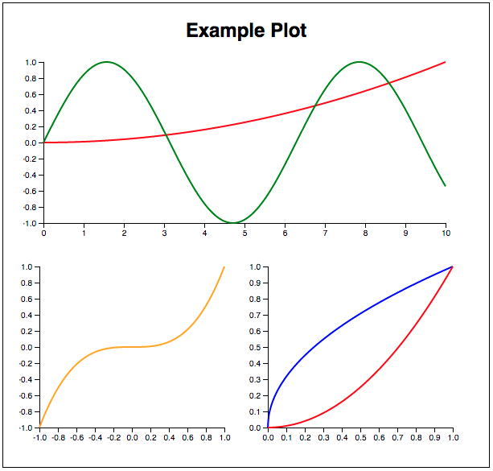

# Polymer Plot Components

A highly modular and configurable symbolic plotter for Polymer. Plotting analytic functions in HTML has never been so easy thanks to SVG, Math.js and D3.js. You may see Polymer as the glue that makes plotting this easy.

#### Wait there, why this in the first place if Google Charts already exists as a Polymer Component?

This is **not** the same as Google Charts. Google Charts is used for plotting **numerical data** in a lot of fashions, Polymer Plot Components is a tool for plotting **symbolical data** as curves.

You usually use Google Charts to plot `[1, 1.05, 0.8, 1.25]`. On the other hand, you use Polymer Plot Components for plotting `x^3` or any formula you want, in any range you want, in any resolution you want, without having to make sample data for each function you want to plot.

## Installation

Install via Bower:

```
bower install --save polymer-plot-components
```

## Usage

Add the collection of components to your document or application:

### What should I include in my app?

```html
<link rel="import" href="bower_components/polymer-plot-components/plot-components.html">
```

### Example

Put this inside anywhere in your document body. You should expect the result to be a `inline-block` component.

```html
<plot-canvas>
  <plot-title>Example Graphic</plot-title>

  <!-- Set a plot area with your own range and dimensions in pixels -->
  <plot-area width="500" height="200" xmin="0" xmax="10">
    <!-- Draw axis as you wish -->
    <plot-x-axis></plot-x-axis>

    <!-- Group lines in the same axis -->
    <plot-y-axis ymin="-1" ymax="1">
      <!-- Each line is easily customizable -->
      <plot-line formula="(0.1*x)^2" line-color="red"></plot-line>
      <plot-line formula="sin(x)" line-color="green"></plot-line>
    </plot-y-axis>
  </plot-area>

  <!-- Break the line for a subplot -->
  <br/>

  <!-- Stack them as you wish. Subplotting is easy -->
  <plot-area width="230" height="200" xmin="-1" xmax="1">
    <plot-x-axis></plot-x-axis>
    <plot-y-axis ymin="-1" ymax="1">
      <plot-line formula="x^3" line-color="orange"></plot-line>
    </plot-y-axis>
  </plot-area>

  <plot-area width="230" height="200" xmin="0" xmax="1">
    <plot-x-axis></plot-x-axis>
    <plot-y-axis ymin="0" ymax="1">
      <plot-line formula="sqrt(x)" line-color="blue"></plot-line>
      <plot-line formula="x^2" line-color="red"></plot-line>
    </plot-y-axis>
  </plot-area>
</plot-canvas>
```

You could expect something like this if everything is okay:

 

## Component reference

A description for using one of each component is described here. ***In construction!***

### plot-canvas

This is the basic canvas structure. It loads the styling and .js libraries, so don't trye using any other component of this library that's not inside this tag.

### plot-title

Sets the title of the plot. Just an `<h1>` with custom styling that you can locate everywhere you want, but usually is on top of the plot :).

### plot-area

Sets a plot area for drawing lines. You must specify its dimensions (`width` and `height`) and the range of `x` where the structure is plotted (`xmin` and `xmax`). The component will do the voodoo of mapping `x` to de plot area (in pixels).

The creation of this component allow you to setup a lot of different plot areas to make sub-plots in the same canvas easily.

### plot-x-axis

Just draws the x axis. If you don't want it in your plot area, don't include it.

### plot-y-axis

Draws an y axis and sets the limit of ymin and ymax. **You must use it to specify plot lines or otherwise they won't work properly.** If you don't want to toggle the axis itself just set `display-axis` property to `false`.

### plot-line

Draws a line inside the plot area. **It must be inside a `<plot-y-axis>` to set image domain and work properly.** You must specify a formula at least. Don't expect this to wowrk otherwise.

Properties:

-   `formula`: formula to be plotted. Use [this](http://mathjs.org/docs/expressions/syntax.html) syntax.
-   `line-color`: line color in css or hex.
-   `line-width`: line width of plotted line.
-   `line-dash-array`: line dash style using [svg-dasharray](https://developer.mozilla.org/en/docs/Web/SVG/Attribute/stroke-dasharray) format.
-   `steps` number of steps to interpolate the line in the range used. If the curve looks weird, increase this number.

## License

BSD License. Check LICENSE.md for more information.

## Contribute

This is yet a purely academical excercise for a college course at Pontifical Catholic University of Chile. More configuration options should be required to have a functional product in a large group of situations.

As we get more experience with Polymer, this could be upgraded and maybe create a fully functional library in the future :).

Feel free to contribute by creating your own branches and pull requests.
